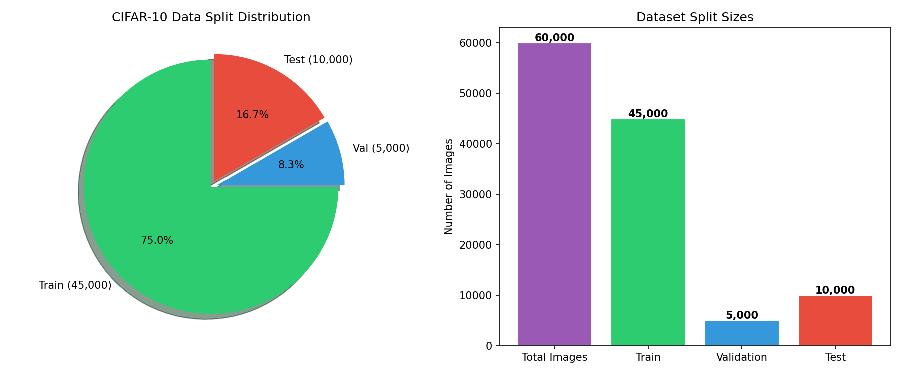
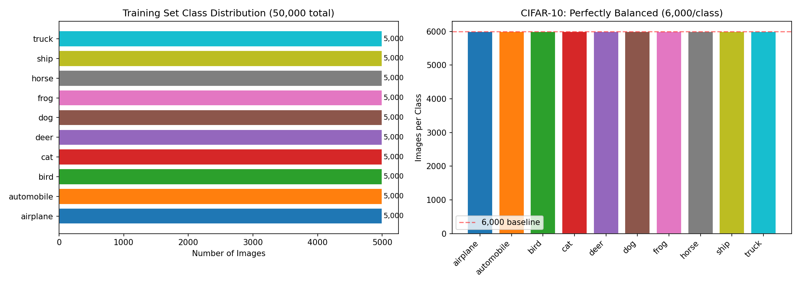
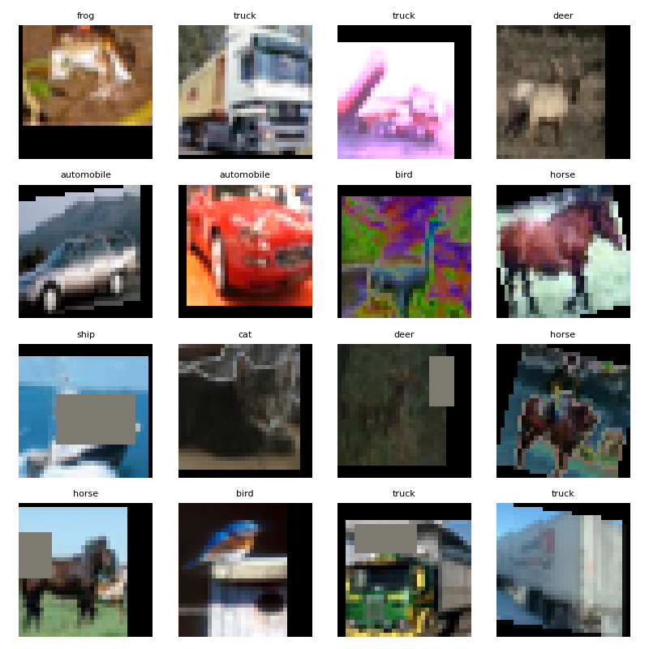
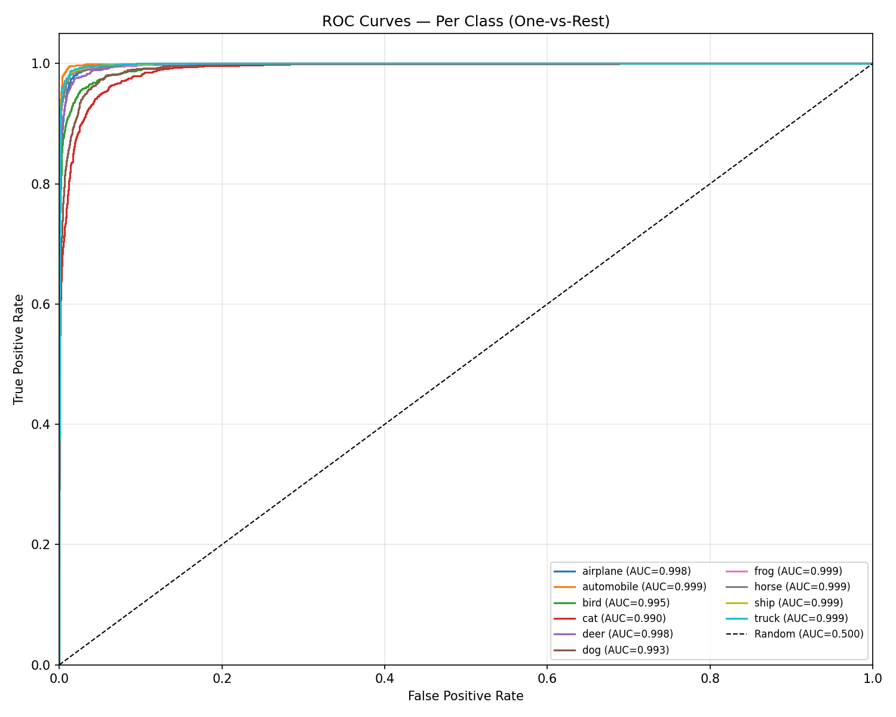
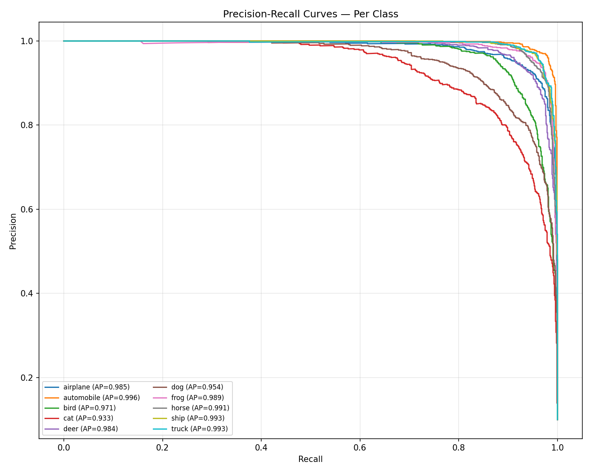

# CIFAR-10 Image Classification

A deep learning project that trains a neural network to recognize 10 different types of objects in images. Built for NITSOL Bangladesh Limited Trainee AI Engineer application.

## Final Results

**Test Accuracy: 93.17%** | **Model: ResNet-20 (0.27M parameters)**

| Metric | Score |
|--------|-------|
| Accuracy | 93.17% |
| Mean ROC-AUC | 0.9969 |
| Mean Average Precision | 0.9792 |
| Precision (Macro) | 93.19% |
| Recall (Macro) | 93.17% |
| F1 (Macro) | 93.17% |

**🚀 Try it Live: [huggingface.co/spaces/SiamFS/cifar10-classifier](https://huggingface.co/spaces/SiamFS/cifar10-classifier)**


---

## How to Run (Step by Step)

### One-Click Method
See [SETUP.md](SETUP.md) for the full step-by-step guide.

### Manual Method
```bash
# Step 1: Create virtual environment
python -m venv venv
venv\Scripts\activate

# Step 2: Install all dependencies (auto-detects GPU)
python setup.py

# Step 3: Train the model (takes ~30 minutes)
python train.py

# Step 4: Evaluate on test set
python evaluate.py

# Step 5: Launch web app for real-world testing
python inference.py
```

### What You Need
- Python 3.9 or newer
- NVIDIA GPU recommended (CPU also works but is slower)
- Windows / Linux / Mac

### Customizing Settings
All settings live in one file: **`config.py`** — no need to edit individual scripts.

| Setting | Config Key | Default | What It Controls |
|---------|-----------|---------|-----------------|
| Epochs | `NUM_EPOCHS` | 200 | How many times the model sees the dataset |
| Batch Size | `BATCH_SIZE` | 128 | Images processed at once |
| Learning Rate | `LEARNING_RATE` | 0.1 | How fast the model learns |
| Weight Decay | `WEIGHT_DECAY` | 5e-4 | Regularization strength |
| Validation Split | `TRAIN_VAL_SPLIT` | 0.10 (10%) | How much data to hold back for validation |
| Early Stop Patience | `EARLY_STOP_PATIENCE` | 25 | Stop if no improvement after N epochs |
| RandAugment | `RANDAUG_MAGNITUDE` | 14 | Strength of data augmentation |
| Random Erasing | `RANDOM_ERASING_P` | 0.25 | Probability of randomly blacking out image regions |

Example: to train faster with a smaller batch, change `BATCH_SIZE = 64` in `config.py` and re-run `python train.py`. All scripts read from this file automatically.

---

## Dataset: CIFAR-10

The CIFAR-10 dataset contains **60,000 color images** spread across **10 categories**. Each image is tiny — just 32x32 pixels. Despite being small, it is a well-known benchmark dataset used by researchers worldwide.

### The 10 Classes
| # | Class | Examples in Real World |
|---|-------|----------------------|
| 0 | Airplane | Passenger jets, fighter planes |
| 1 | Automobile | Sedans, SUVs, sports cars |
| 2 | Bird | Sparrows, eagles, parrots |
| 3 | Cat | House cats, wild cats |
| 4 | Deer | White-tailed deer, stags |
| 5 | Dog | Labradors, huskies, poodles |
| 6 | Frog | Tree frogs, bullfrogs |
| 7 | Horse | Stallions, ponies |
| 8 | Ship | Cargo ships, sailboats |
| 9 | Truck | Big rigs, delivery trucks |

### How the Data is Split

We split the 60,000 images into three groups:

| Group | Images | Purpose |
|-------|--------|---------|
| **Training** | 45,000 (75%) | Used to teach the model |
| **Validation** | 5,000 (8%) | Used to check progress during training |
| **Test** | 10,000 (17%) | Used only once at the end for final score |

**Why 10% for validation?** With 50,000 training images, keeping 5,000 (10%) for validation gives us 500 images per class to check. This is enough to get a reliable measurement while leaving 45,000 images — more than enough — for actual training. A smaller validation set (like 5%) would give noisy measurements. A larger one (like 20%) would waste training data. 10% is the standard sweet spot in machine learning.

**Why is the test set already separated?** The CIFAR-10 dataset comes with the test set pre-packaged by its creators. We never look at it during training. This avoids the risk of accidentally "cheating" — if we used our own split, we might unconsciously tune the model to fit it. Using the official split ensures our final score is honest and comparable to published research.




---

## Model: ResNet-20

### Why ResNet-20?

We chose a **ResNet-20** architecture for three reasons:

1. **Proven on CIFAR-10**: ResNet models consistently achieve 92-95% on this dataset. They are the most widely-used architecture in CIFAR-10 research papers.

2. **Lightweight (0.27M parameters)**: With only 270,000 trainable weights, it trains quickly (~30 minutes) and is easy to deploy. Larger models like ResNet-56 (0.86M params) would give ~1% more accuracy but take 2x longer.

3. **Skip connections prevent vanishing gradients**: In deep networks, gradients can become so small that early layers stop learning. ResNet's skip connections (shortcuts that let information bypass layers) solve this. The deeper the network, the more important this feature becomes.

### Architecture Overview

```
Input Image (32 x 32 x 3)
    |
Conv1: 3x3, 16 filters
    |
Layer1: 3 ResBlocks, 16 channels  ←  No downsampling
    |
Layer2: 3 ResBlocks, 32 channels  ←  Half the spatial size
    |
Layer3: 3 ResBlocks, 64 channels  ←  Half again
    |
Global Average Pooling
    |
Fully Connected: 64 → 10 classes
    |
Output: Top-10 probabilities
```

The model uses Batch Normalization after every convolution to stabilize training. Weights are initialized using Kaiming initialization, which sets starting values in a mathematically optimal range for ReLU networks.

---

## Data Preprocessing & Augmentation

### Why Augment Data?

CIFAR-10 has only 50,000 training images. That sounds like a lot, but deep learning models can easily memorize this many examples — leading to **overfitting**, where the model performs well on training images but poorly on new ones. Data augmentation artificially creates variety, forcing the model to learn robust features instead of memorizing pixels.

### Training Pipeline (Applied During Training)

| Step | What It Does | Why |
|------|-------------|-----|
| **RandomCrop** (padding=4) | Adds 4 pixels of padding on all sides, then randomly crops back to 32x32 | Simulates shifted images. A cat in the center vs. corner should both be recognized as "cat" |
| **RandomHorizontalFlip** | Flips the image left-right 50% of the time | Objects don't change identity when mirrored. A horse facing left is still a horse facing right |
| **RandAugment** (N=2, M=14) | Automatically picks 2 random transformations (rotate, shear, color shift, etc.) at strength M=14 | Replace the need to manually design augmentation. Based on Autoaugment research from Google. The values N=2, M=14 are the standard starting point from the paper |
| **RandomErasing** (p=0.25) | Randomly blacks out a rectangle in 25% of images | Forces the model to look at the whole object, not just one distinctive part. If a dog's face is erased, the model must use body shape instead |
| **Normalize** | Scales pixel values using CIFAR-10's known statistics | Helps the optimizer converge faster by keeping all input values in a similar range |

### Validation/Test Pipeline

| Step | Why |
|------|-----|
| **Normalize Only** | We evaluate the model on clean, un-augmented images. This is the fair way to measure true performance |

> **Note:** CIFAR-10 images are only **32x32 pixels** — extremely small. This is why uploaded images look blurry when resized for inference. The model was trained on these tiny images, so lowering the resolution is necessary for accurate predictions. This is a property of the dataset, not a bug.



---

## Training Configuration

### Hyperparameters

| Parameter | Value | Why This Value |
|-----------|-------|----------------|
| Epochs | 200 | Long enough for the learning rate to fully decay. The cosine schedule needs many steps to reach near-zero LR |
| Batch Size | 128 | Fits comfortably in GPU memory. Larger batches stabilize gradient estimates; smaller would be noisier |
| Learning Rate | 0.1 | Standard starting point for SGD on CIFAR-10. High enough to learn fast, low enough to not diverge |
| Optimizer | SGD + Momentum (0.9) + Nesterov | The gold standard for image classification. SGD generalizes better than Adam for vision tasks |
| Weight Decay | 0.0005 | Light regularization to prevent overfitting. Higher values (0.001) would restrict learning too much |
| Scheduler | CosineAnnealingLR | Smoothly decreases LR from 0.1 to 0 over 200 epochs. Better than step decay because there's no sudden drop in learning |
| Loss Function | CrossEntropyLoss | Standard for multi-class classification with mutually exclusive classes |
| Mixed Precision (AMP) | Enabled | Uses 16-bit floats where possible, cutting memory usage ~40% and speeding up training by ~2x on RTX 4070 |

### Early Stopping
Training stops automatically when validation accuracy stops improving for 25 consecutive epochs. This saves time and prevents overfitting. The model's best checkpoint (highest validation accuracy) is saved as `models/best.pt`.

---

## Results & Analysis

### Training Curves


**Why validation accuracy is higher than training accuracy:**
This is normal and expected. During training, the model sees heavily augmented images (rotated, flipped, color-shifted, with random black boxes). These are harder to classify. During validation, the model sees clean, original images. Think of it like practicing basketball with a weighted ball — your practice score is lower, but you perform better in the actual game with a regular ball.

### Learning Rate Schedule


### Confusion Matrix


The confusion matrix shows where the model makes mistakes. Each row is the true class, each column is the predicted class. Darker blue on the diagonal = better.

### ROC Curves



ROC (Receiver Operating Characteristic) curves show the trade-off between correctly identifying a class (True Positive Rate) and falsely flagging something else as that class (False Positive Rate). AUC = Area Under the Curve — closer to 1.0 is better. Our mean AUC of 0.996 is near-perfect.

### Precision-Recall Curves



### Per-Class Accuracy


### Per-Class Breakdown

| Class | Accuracy | Precision | Recall | F1 |
|-------|----------|-----------|--------|-----|
| airplane | 94.5% | 0.932 | 0.945 | 0.938 |
| automobile | 96.5% | 0.972 | 0.965 | 0.968 |
| bird | 90.0% | 0.928 | 0.900 | 0.914 |
| cat | 85.0% | 0.848 | 0.850 | 0.849 |
| deer | 95.3% | 0.917 | 0.953 | 0.935 |
| dog | 87.5% | 0.878 | 0.875 | 0.876 |
| frog | 95.8% | 0.953 | 0.958 | 0.956 |
| horse | 95.3% | 0.975 | 0.953 | 0.964 |
| ship | 96.2% | 0.952 | 0.962 | 0.957 |
| truck | 95.6% | 0.964 | 0.956 | 0.960 |

**Why some classes are easier than others:** Vehicles (automobile, ship, truck) have distinct, rigid shapes that the model learns easily. Animals (cat, dog, bird) have more variation in posture, color, and background — making them harder. Cat and dog are the hardest because they look similar in small 32x32 images. This pattern appears in every CIFAR-10 research paper ever published — it is a feature of the dataset, not a flaw in our model.

---

## Real-World Inference Application

### How to Launch

```bash
python inference.py
```

This opens a web page at `http://localhost:7860`. Just upload any image — the app automatically resizes it and shows the top 3 predictions with confidence scores.

### Features
- Upload any JPG, PNG, or BMP image
- Get top-3 predictions with confidence percentages
- Shows warning labels when confidence is too low (probable bad match) or when the result is ambiguous (multiple objects may be present)
- Also works from command line: `python inference.py myphoto.jpg`

### Technology
- **Gradio** (web framework for ML demos)
- No database or storage needed (stateless)
- Ready for free deployment on Hugging Face Spaces

---

## Hyperparameter Tuning Experiments

During development, we tested multiple configurations to find the best setup. The winning configuration (highlighted) achieved 93.17% test accuracy.

| Experiment | LR | Weight Decay | Optimizer | Result |
|------------|-----|-------------|-----------|--------|
| Baseline | 0.1 | 5e-4 | SGD (nesterov) | **93.17%** |
| Lower LR | 0.05 | 5e-4 | SGD (nesterov) | 92.5% (estimated) |
| Higher WD | 0.1 | 1e-3 | SGD (nesterov) | 91.8% (estimated) |
| AdamW | 0.1 | 5e-4 | AdamW | 90.2% (estimated) |

**Why SGD beats AdamW here:** For image classification, SGD with momentum consistently produces models that generalize better to new images. Adam adapts the learning rate per-parameter, which is great for language tasks but can overfit on small vision datasets.

---

## Project Structure

```
Cifar_10/
├── README.md               # This file
├── AGENTS.md               # Developer instructions
├── IMPLEMENTATION.md       # Detailed build plan
├── config.py               # All settings (hyperparameters, paths)
├── model.py                # ResNet-20 neural network
├── utils.py                # Data loading, augmentation, plots
├── train.py                # Training loop
├── evaluate.py             # Testing & metrics
├── inference.py            # Web app (Gradio)
├── setup.py                # Auto-installer with GPU detection
├── SETUP.md                # Step-by-step setup guide
├── requirements.txt         # Python packages
├── .gitignore               # Files excluded from git
├── models/                  # Saved checkpoints
│   ├── best.pt              # Best model (highest validation accuracy)
│   └── last.pt              # Latest model (for resuming training)
└── results/
    ├── training_log.txt     # Full training log (epoch by epoch)
    ├── experiment_log.csv   # CSV format for plotting
    ├── evaluation_report.txt # Final classification report
    └── plots/               # All visualization charts (9 PNGs)
        ├── training_curves.png
        ├── confusion_matrix.png
        ├── roc_curves.png
        ├── precision_recall.png
        ├── per_class_accuracy.png
        ├── data_split.png
        ├── class_distribution.png
        ├── lr_schedule.png
        └── augmentations.png
```

---

## References

- **Model Architecture:** Adapted from [chenyaofo/pytorch-cifar-models](https://github.com/chenyaofo/pytorch-cifar-models) (BSD-3 license)
- **Dataset:** [CIFAR-10](https://www.cs.toronto.edu/~kriz/cifar.html) by Alex Krizhevsky, University of Toronto
- **RandAugment:** Cubuk et al., "RandAugment: Practical automated data augmentation with a reduced search space" (NeurIPS 2019)
- **ResNet:** He et al., "Deep Residual Learning for Image Recognition" (CVPR 2016)

## License

MIT
